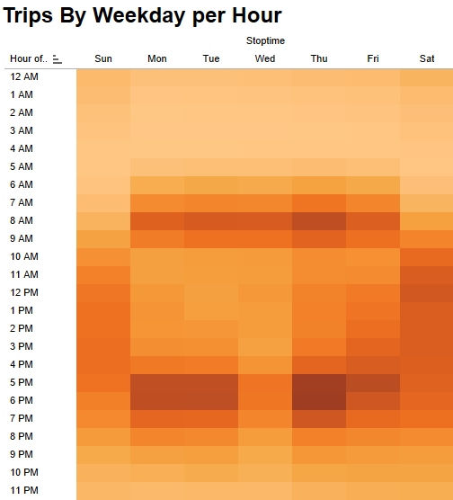

# Business Analysis: NYC CitiBike
----------------------------------------------------------------------------------

## Overview of the Statistical Analysis 
Citi Bike is a privately owned public bicycle sharing system serving the New York City boroughs of the Bronx, Brooklyn, Manhattan, and Queens, as well as Jersey City, New Jersey. The intent of this analysis is to study the NYC ride sharing service to determine the feasibility of a similar program in Des Moines.  

## Data Sources
Data for analysis was obtained from the Citi Bike website. Slight data manipulation was performed using  in Juptyer Notebook.  

## Results

 
 
Although not the only bicycle sharing business in the area, as shown above, Citi Bike is ubiquitous within the New York City boroughs.  Citi Bike began operations in the spring of 2013 with over 300 bike stations.  The service has experienced tremendous growth over its first 8 years now operating with over 1,000 stations, 17,000 bicycles and a daily ridership of nearly 50,000 people.  
 
 
 

 
 
In August of 2019, Citi Bike facilitated over 2.3 million rides. Surveys of nearly 2/3 of the riders indicate a ridership of both men and women.  
 
 
 

 
 
Citi Bike offers a number of rider plans including annual, weekday, daily and single-ride passes. Note that the day-pass allows for 24 hour rental.  The graph above shows rentals can last from less than an hour to the 24 hour limit, with most typical rides lasting 4-6 hours.     
 
 
 

 
 
The above graph breaks out checkout time by gender and produces the same rental time trend across gender.  However, the number of bikes allocated to males is 3:1 at peak trip duration of 4-6 hours.  
 
 
 

 
 
The heat map shows during weekdays, rentals are concentrated during rush hours (6:00am - 9:00am and 4:00pm-8:00pm) as customers travel to and from work.  

Weekend customers tend to checkout bikes thorughout the day, concentrated fairly evenly between 9:00am - 8:00pm.
 
 
 

 
 
Rental time trends continue across genders for both weekday and weekend riders.
 
 
 

 
 
The volume of Annual Membership riders is significantly greater than that for Day Pass riders weeklong.  

The volume of both male and female Subcriber riders stays fairly consistant throughout the week.  

Although male riders are predominant, female riders are common as well.   
 
 
 

## Summary
* Figure 1 provides a composite look at Pyber's ride-sharing business in 2019.  As known, the larger cities (relative driver count per city depicted by marker size) shouldered the ride volume.  However, driven down by competition, fares were significantly lower in high volume areas.  

* Table 1 provides a summary of the ride sharing business by city type.  Specific items of note include the following:
  * 63% of gross revenue from urban markets with 30% from suburban areas and the balance, rural.    
  * Rural drivers accounted for 2.6% of the total driver workforce yet brought in nearly 7% of revenue.  
  * Average fare per driver in rural areas was 335% that of urban drivers.  While suburban drivers were 238% that of their urban counter parts. 
 
 * Figure 2 further demonstrates the disparity in gross revenue between city types over time.  For each, there was monthly fluctuations, yet little movement in trend.  
  
## Recommendations 
* With potential saturation in the urban markets, focus on development of suburban and rural businesses.  
* Entice rural customer growth with short-term discounted prices or provide loyalty discounts for repeat riders. 
* Provide additional resources (drivers) in potential growth markets (rural and suburban).  

